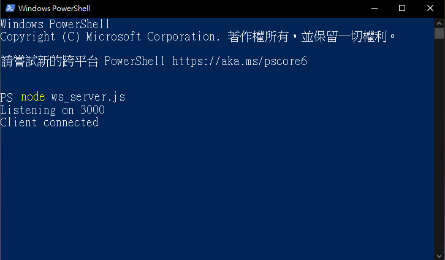
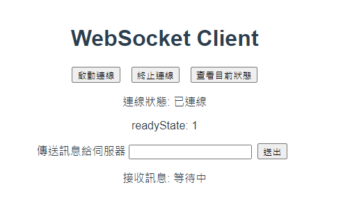

# WebSocket practice

## Introduction 說明
Create local WebSocket server and client.  
建立本地端WebSocket伺服器與用戶端

## NPM install
```
npm install
```

### Launch WS server 伺服器啟動
```
node ws_server.js
```

### Launch WS client 用戶端啟動
```
npm run server
```

### Preview 預覽




### References
[JavaScript | WebSocket 讓前後端沒有距離](https://medium.com/enjoy-life-enjoy-coding/javascript-websocket-%E8%AE%93%E5%89%8D%E5%BE%8C%E7%AB%AF%E6%B2%92%E6%9C%89%E8%B7%9D%E9%9B%A2-34536c333e1b)  
[How to read BLOB data from a WebSocket which is not an image](https://stackoverflow.com/questions/21338263/how-to-read-blob-data-from-a-websocket-which-is-not-an-image)  
[MDN WebSocket](https://developer.mozilla.org/zh-TW/docs/Web/API/WebSocket)  
[BLOB（Binary Large Object）](https://developer.mozilla.org/zh-TW/docs/Web/API/Blob)
